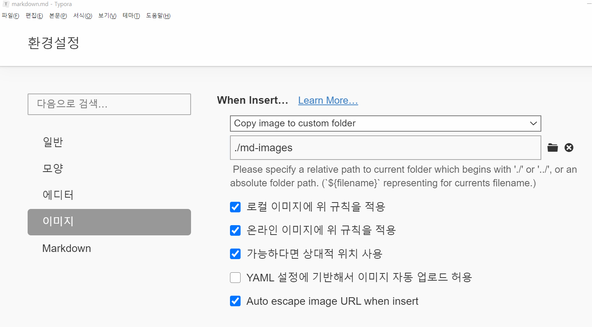

# 마크다운 활용법

## 제목(heading)

### h3

#### h4

##### h5

## 목록

* 순서가 없는 목록
* 순서가 없어요
  * tab을 통해 하위 목록
* shift+tab으로 상위

1. 순서가 있는 목록
2. 순서가 있어요
   1. tab으로 하위목록
3. shift+tab으로 상위

## 코드블록

~~~java
int j = 10;
double dj = 10.143;
System.out.println("Hello MarkDown!");
//주석
~~~

~~~html
<h1>
    안녕하세요
</h1>
<!-- 주석 -->
~~~

`//`은 주석을 작성할 때 사용.(`)

## 링크

[네이버](https://www.naver.com/)

| 순번 | 이름   | 나이 | 직무 |
| ---- | ------ | ---- | ---- |
| 1    | 조주형 | 30   | 몰입 |
| 2    | 임종범 | 28   | 존못 |

## 이미지

* 가능하다면 아래와 같이 typora 설정을 하여 상대 경로로 이미지를 관리하자

*기울임* ->별하나

**볼드체** ->별두개

~~취소선~~ -> 물결두개

